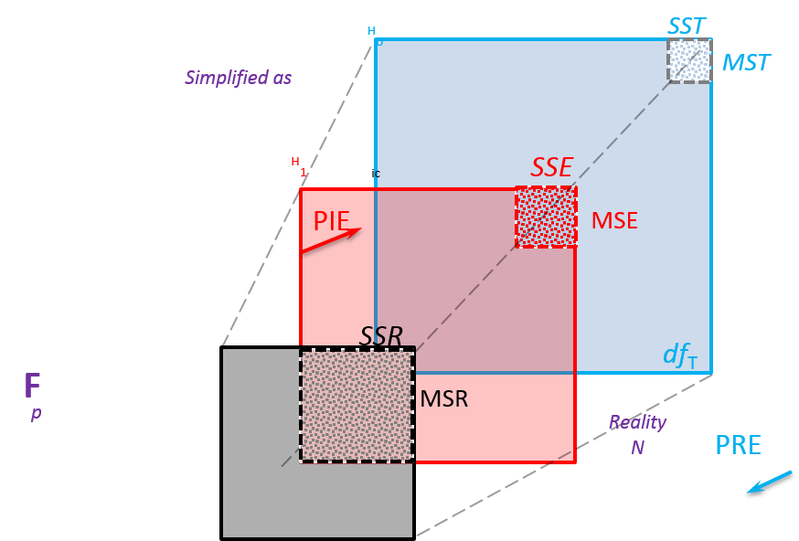
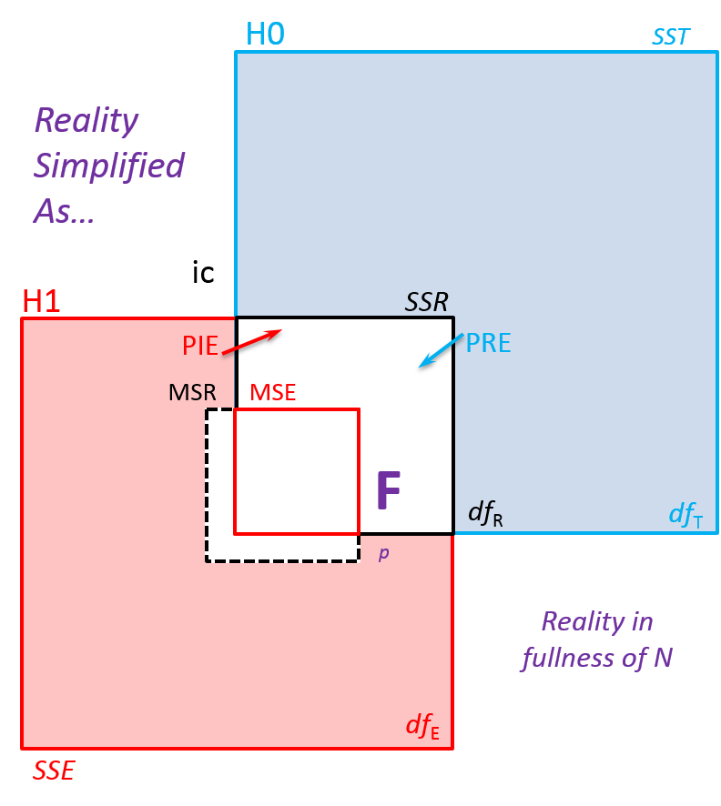
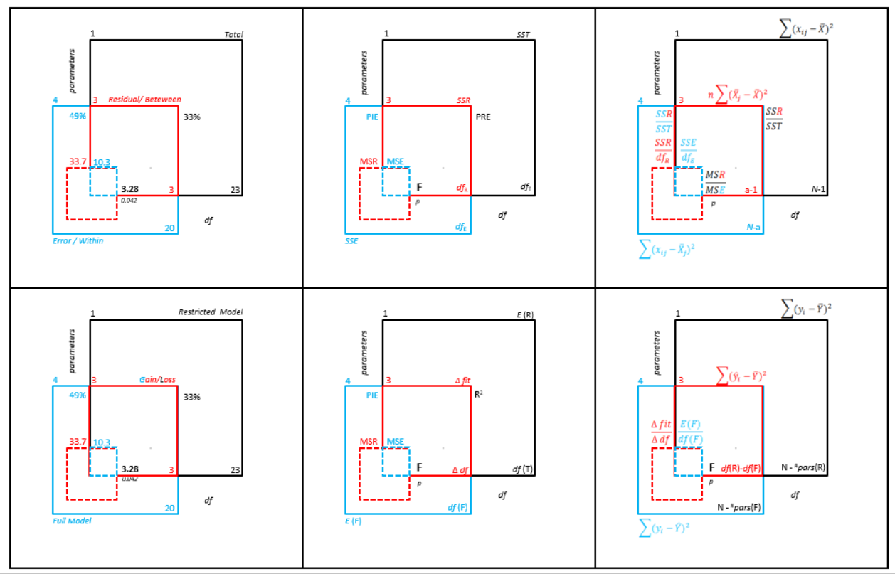

Geometric representation of Model Comparison
---

areaF is a visual display of ANOVA table, comparing and contrasting the properties of restricted (basic, null) and full(saturated, alternative) models.

## Concept Art

The key quantitative property of a statistical model is **misfit**: the discrepancy between model prediction and  observed data. We identify  this quantity as the "Sum of Squares" (implying model error), "SS" for short. The misfit of the simpler, restricted model, will be called **SST**, "T" standing for "Total" (to imply the baseline). The error of the more complex, full model will be called **SSE**, "E" standing for "Error" (to emphasize our focus on the FULL model).  These values are in squared units, so it is natural to concieve of them as areas.








| Used abbreviations        | Restricted  | Full  |
|---|---|---|
|  | Total  | Error   |
|Sum of Squared Error  | SST  | SSE |
|Mean Squared Error   | MST   | MSE   |


### areaF: Re-create in R
Quick graphs of model comparison. Copy/past the following script in R console and execute to produce the graph: 
```
rm(list=ls(all=TRUE)) # clear environment
cat("\f") # clear console
library(ggplot2) # load ggplot2 package for graphing
# load areaF function
source("https://raw.githubusercontent.com/andkov/psy532/master/scripts/graphs/areaF_graphing.R")
areaF(6136, 26, 6525, 29 )
```

ANOVA tables contain comparison of two models:  Null or Restricted (producing SSTotal) and Full or Saturated (SSError). 